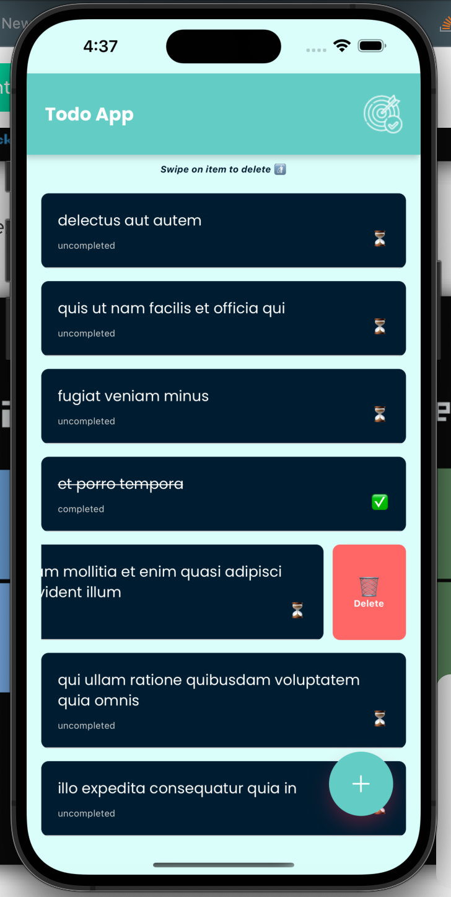
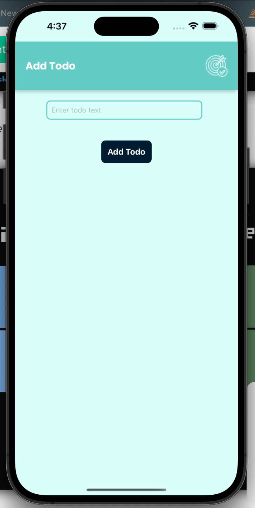
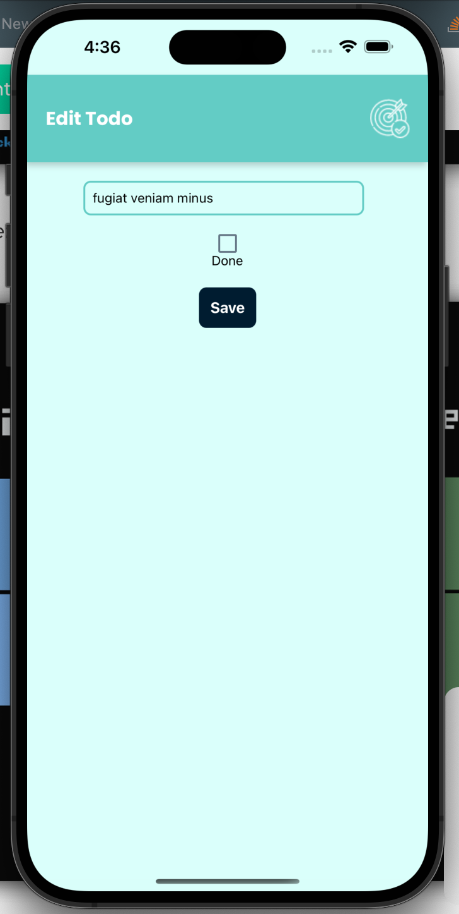
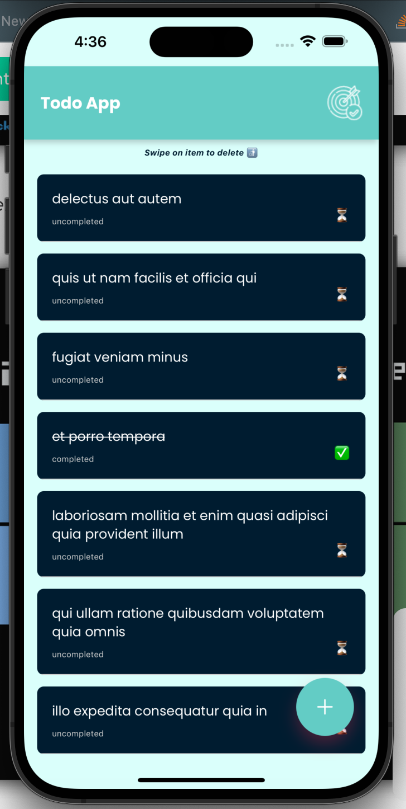

# React Native Todo App

This is a mobile application built using React Native that allows users to manage their to-do lists. The app utilizes various libraries and tools to provide efficient state management, handle asynchronous actions, ensure type safety, and enable dependency injection.

# App Design & Prototype

The app prototype design can be found at https://app.uizard.io/p/ad52b6c3/preview.
Please refer to this link to see the app prototype.

## App Screenshots

<div style="display: grid; flex-wrap: wrap;">
  <div style="flex: 50%; padding: 5px;">
    
  </div>
  <div style="flex: 50%; padding: 5px;">
    
  </div>
  <div style="flex: 50%; padding: 5px;">
    
  </div>
  <div style="flex: 50%; padding: 5px;">
    
  </div>
</div>

## Features

- Create new to-do items
- Edit existing to-do items
- Mark to-do items as completed
- Delete to-do items

## Tech Stack

The app is built using the following technologies:

- React Native: A framework for building mobile applications using JavaScript and React. (https://reactnative.dev/docs/getting-started)
- Redux-Toolkit: A set of tools and conventions for managing the state of your React application.(https://redux-toolkit.js.org/)
- Redux Observable: A middleware for handling asynchronous actions with RxJS.(https://redux-observable.js.org/)
- Tsyringe: A dependency injection container for TypeScript.(https://github.com/microsoft/tsyringe)
- TypeScript: A statically typed superset of JavaScript that adds type safety to the codebase.(https://www.typescriptlang.org/docs/)
- Jest: For testing (https://jestjs.io/docs/getting-started)

## Setup and Installation

1. Clone the repository.

```bash
git clone https://github.com/kobbycoder/todo.git

```

1. Install dependencies

```bash
cd react-native-todo-app
npm install

```

2. Run the app

```bash
npm start
```

## Folder Structure

```bash
react-native-todo-app/
  ├── src/
  │   ├── components/       # React components
  │   ├── store/            # Redux store setup and configuration
  │   ├── types/            # TypeScript type definitions
  │   ├── services/         # Services for handling API calls or data fetching
  │   ├── utils/            # Utility functions and helpers
  │   ├── App.tsx           # Entry point of the app
  │   ├── index.tsx         # Root file to register the app
  │   └── ...
  ├── __tests__/            # Unit tests and integration tests
  ├── assets/               # Image and font assets
  ├── node_modules/         # Installed npm packages
  ├── package.json          # Project dependencies and scripts
  ├── tsconfig.json         # TypeScript configuration
  ├── .babelrc              # Babel configuration
  └── ...
```

## Testing

The app includes unit tests and integration tests to ensure code quality and functionality. You can run the tests using the following command:

```bash
npm test
```

## Test Plan

Please refer to this link to see the app test plan:
https://docs.google.com/document/d/1_fwV1IXncOIQTc34wNX6kS3eliMMXbUZEzUWCg-mNr0/edit?usp=sharing

## Simple Todo App
